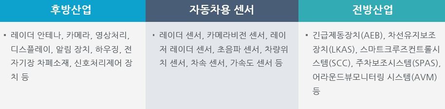

# 자동차용 센서 - 전후방 산업구조 분석

자동차용 센서의 산업생태계에서 후방산업은 센서부품 생산산업으로 구성되여있고 전방산업은 자동차용 센서를 활용하는 지능형 자동차를 생산하는 구조로 구성되여 있습니다. 후방산업에는 레이더 안테나, 카메라, 영상처리, 디스플레이, 알림 장치, 하우징, 전자기장 차폐소재, 신호처리제어 장치 등이 있습니다.

자동차용 센서에는 레이더 센서, 카메라비전 센서, 레이저 레이더 센서, 초음파 센서, 차량위치 센서, 차속 센서, 가속도 센서 등이 있습니다. 전방산업에는 긴급제동장치(AEB), 차선유지보조장치(LKAS), 스마트크루즈컨트롤시스템(SCC), 주차보조시스템(SPAS), 어라운드뷰모니터링 시스템(AVM) 등이 있습니다.

## 참고문서
- KISTI 유망아이템 지식 베이스: [http://boss.kisti.re.kr/boss/item/item_print.jsp?unit_cd=PI000017](http://boss.kisti.re.kr/boss/item/item_print.jsp?unit_cd=PI000017)
