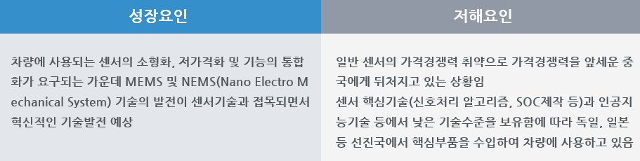

# 자동차용 센서 - PEST 분석

성장요인으로는 차량에 사용되는 센서의 소형화, 저가격화 및 기능의 통합화가 요구되는 가운데 MEMS 및 NEMS(Nano Electro Mechanical System) 기술의 발전이 센서기술과 접목되면서 혁신적인 기술발전 예상됩니다.
저해요인으론 일반 센서의 가격경쟁력 취약으로 가격경쟁력을 앞세운 중국에게 뒤쳐지고 있는 상황입니다. 센서 핵심기술(신호처리 알고리즘, SOC제작 등)과 인공지능기술 등에서 낮은 기술수준을 보유함에 따라 독일, 일본 등 선진국에서 핵심부품을 수입하여 차량에 사용하고 있습니다.

정치적으로는 인구 고령화에 따른 운전보조 시스템 도입하였고 정부 주도로 교통사고 제로(zero)화를 위한 안전규제 강화 및 첨단안전장치 의무장착 확대, 특히 미국, EU는 스마트카 안전부품의 의무장착을 확대 중입니다.

경제적으론 국내 기업은 일반 센서의 가격경쟁력이 취약하여 가격경쟁력을 앞세운 중국에게 뒤쳐지고 있는 상태입니다.
기술적으로는 최근에 MEMS형 센서개발 및 적용이 확대되고 있으며, 현재 대부분 자동차의 에어백에는 MEMS형 가속도 센서가 적용되고 있고, 이 공정기술을 활용한 센서의 종류는 점차 늘어나고 있는 추세이고 반면 센서 핵심기술(신호처리 알고리즘, SOC제작 등)과 인공지능기술 등에서 낮은 기술수준을 보유함에 따라 독일, 일본 등 선진국에서 핵심부품을 수입하여 차량에 사용하고 있습니다.

사회적으로는 교통사고로 인한 사회적 비용 증대, 삶의 질 향상에 대한 인식의 확산 및 급격한 고령화사회 진입 등으로 안전하고 편리한 차에 대한 요구가 증대하고 있습니다.

## 참고문서
- KISTI 유망아이템 지식 베이스: [http://boss.kisti.re.kr/boss/item/item_print.jsp?unit_cd=PI000017](http://boss.kisti.re.kr/boss/item/item_print.jsp?unit_cd=PI000017)
