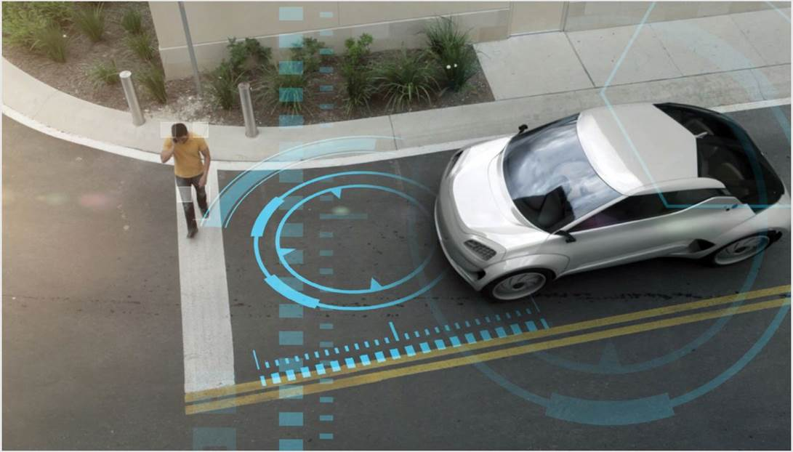

# 자동차용 센서 - 개념

자동차용 센서는 자동차의 내부 및 외부 상태를 감지 또는 측정하는 장치입니다. 편의성, 안전성, 친환경성에 대한 요구가 증대되면서 자동차 기능에 필요한 정보를 실시간으로 파악하고 감지하는 '스마트카'라는 개념이 등장하였으며 스마트카용 센서 시장이 점차 성장할 것으로 전망입니다. 스마트카는 안전하고 편리한 교통환경을 확보하고 교통사고로 인한 인적, 물적 손실을 최소화하여 단순한 이동수단에서 이동 욕구를 보다 스마트하게 구현하는 방향으로 발전합니다.

주행 상황을 정확히 판단하기 위한 주행 환경 인식 기술, 자동차 운동을 제어하기 위한 주행 제어 기술, 다양한 정보 획득을 위한 자동차간, 자동차와 인프라 간의 통신 기술, 운전자와 자동차 간의 소통을 원활하게 하는 HMI 기술 등 다양한 기술의 융합이 매우 중요합니다.

## 참고문서
- KISTI 유망아이템 지식 베이스: [http://boss.kisti.re.kr/boss/item/item_print.jsp?unit_cd=PI000017](http://boss.kisti.re.kr/boss/item/item_print.jsp?unit_cd=PI000017)
