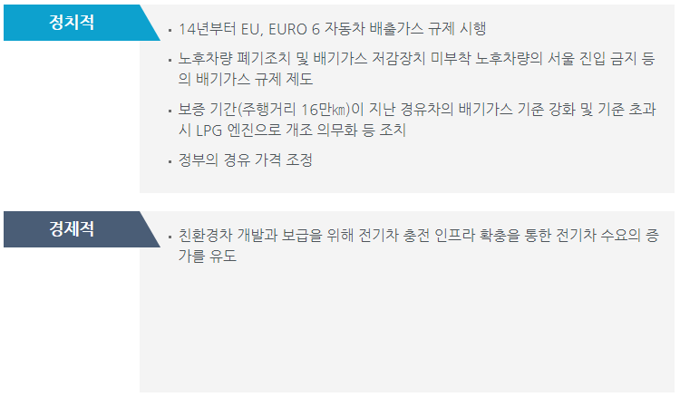
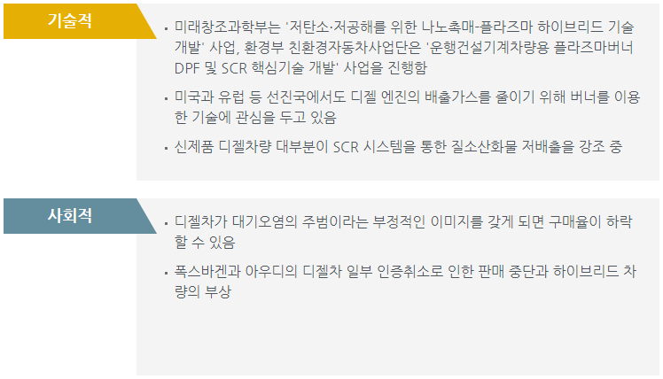
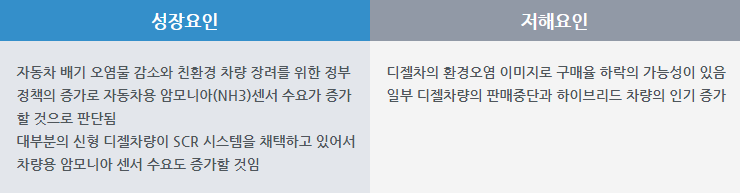

# 자동차용암모니아센서 시장의 PEST 분석은?

정치적 분석입니다.
14년부터 EU, EURO 6 자동차 배출가스 규제를 시행했습니다. 노후차량 폐기조치 및 배기가스 저감장치 미부착 노후차량의 서울 진입 금지 등의 배기가스 규제 제도가 나타났습니다. 보증 기간(주행거리 16만㎞)이 지난 경유차의 배기가스 기준 강화 및 기준 초과 시 LPG 엔진으로 개조 의무화 등 조치를 취했습니다. 정부의 경유 가격 조정이 있었습니다.
경제적 분석입니다.
친환경차 개발과 보급을 위해 전기차 충전 인프라 확충을 통한 전기차 수요의 증가를 유도하였습니다.
기술적 분석입니다.
미래창조과학부는 '저탄소·저공해를 위한 나노촉매-플라즈마 하이브리드 기술개발' 사업, 환경부 친환경자동차사업단은 '운행건설기계차량용 플라즈마버너 DPF 및 SCR 핵심기술 개발' 사업을 진행하였습니다. 미국과 유럽 등 선진국에서도 디젤 엔진의 배출가스를 줄이기 위해 버너를 이용한 기술에 관심을 두고 있습니다. 신제품 디젤차량 대부분이 SCR 시스템을 통한 질소산화물 저배출을 강조 중입니다.
사회적 분석입니다.
디젤차가 대기오염의 주범이라는 부정적인 이미지를 갖게 되면 구매율이 하락할 수 있습니다. 폭스바겐과 아우디의 디젤차 일부 인증취소로 인한 판매 중단과 하이브리드 차량이 부상하고 있습니다.

