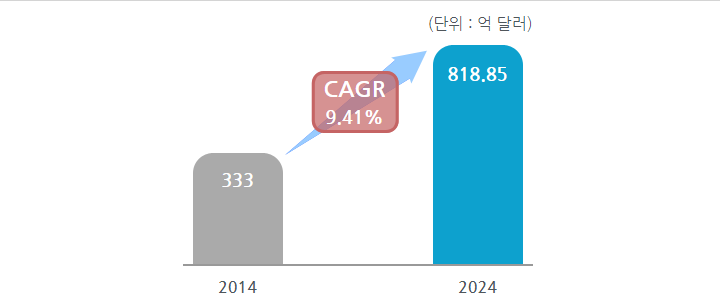
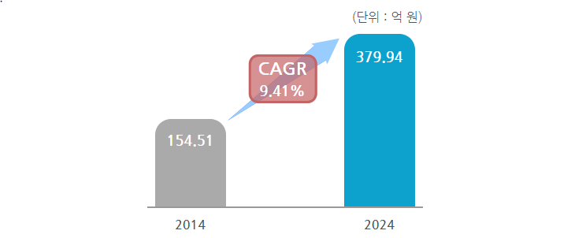

# 자동차용 암모니아센서 - 성장률

세계 자동차용 촉매 변환 시장은 2014년 333억 달러에서 2024년 818.85억 달러로 연평균 9.41%로 성장할 것으로 예상됩니다. 세계 자동차용 촉매 변환 시장은 2014년 1110억 달러에서 2024년 2729.5억 달러로 예상됩니다. 하이브리드 카 시장점유율은 30%로 예상됩니다.

국내 자동차용 촉매 변환 시장은 2014년 154.51억 원에서 2024년 379.94억원으로 연평균 9.41%로 성장할 것으로 예상됩니다. 2017년 국내 자동차 시장의 세계 점유율은 5.8% 입니다. 환율은 1달러 1200원으로 계산했습니다. 전기차 국내 보급률은 2015년 0.2% 였습니다.

