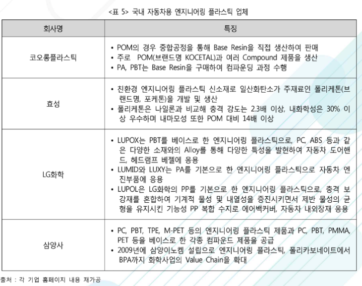

# 자동차용 엔지니어링 플라스틱 - 국내 주요 기업

국내 엔지니어링 플라스틱업체로는 코오롱플라스틱, 효성, LG화학, 삼양사 등이 있습니다. 코오롱플라스틱은 주로 브랜드명이 KOCETAL인 POM과 여러 컴파운드 제품을 생산하고 있습니다.

2016년 코오롱과 바스프는 합작으로 코오롱바스프이노폼을 설립, 엔지니어링 플라스틱 원료인 POM을 생산하고, POM 자체 중합 설비를 보유하여 안정적인 원재료 수급 및 원가 경쟁력을 보유하고 있습니다.

LG화학은 '폴리카보 네이트(PC)'와 '루폭스'를 주력으로 특히 자동차용 제품에서 기술력을 확보하고 있습니다.

효성은 폴리케톤 신사업으로 엔지니어링 플라스틱 시장에서 점진적으로 영역을 확대중입니다.

## 참고문서
- BOSS Report: 27-2016-자동차용 엔지니어링_플라스틱.pdf
