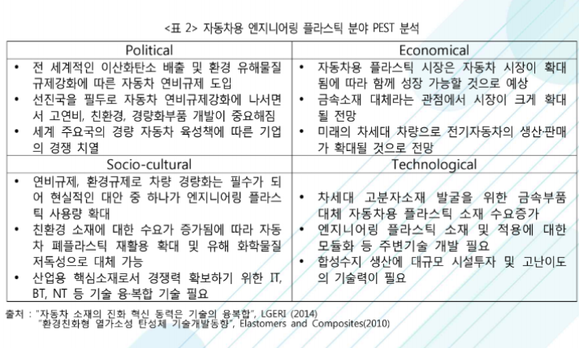

# 자동차용 엔지니어링 플라스틱시장의 PEST는?

Political 관점에서는 전 세계적인 이산화탄소 배출 및 환경 유해물질
규제강화에 따른 자동차 연비규제 도입, 
선진국을 필두로 자동차 연비규제강화에 나서면
서 고연비, 친환경, 경량화부품 개발이 중요해졌습니다. 또한 세계 주요국의 경량 자동차 육성책에 따른 기업
의 경쟁이 치열합니다.
 
Economical 관점에서는 자동차용 플라스틱 시장은 자동차 시장이 확대
됨에 따라 함께 성장 가능할 것으로 예상되고 금속소재 대체라는 관점에서 시장이 크게 확대
될 전망입니다. 또한 미래의 차세대 차량으로 전기자동차의 생산·판매
가 확대될 것으로 전망됩니다. 

Socio-cultural 관점에서는 연비규제, 환경규제로 차량 경량화는 필수가 되
어 현실적인 대안 중 하나가 엔지니어링 플라스
틱 사용량 확대이고, 
친환경 소재에 대한 수요가 증가됨에 따라 자동
차 폐플라스틱 재활용 확대 및 유해 화학물질
저독성으로 대체 가능합니다. 또한 산업용 핵심소재로서 경쟁력 확보하기 위한 IT,
BT, NT 등 기술 융·복합 기술이 필요합니다. 

Technological 관점에서는 차세대 고분자소재 발굴을 위한 금속부품
대체 자동차용 플라스틱 소재 수요증가, 엔지니어링 플라스틱 소재 및 적용에 대한
모듈화 등 주변기술 개발이 필요합니다. 

 

## 참고문서
- 27-2016_자동차용_엔지니어링_플라스틱.pdf 