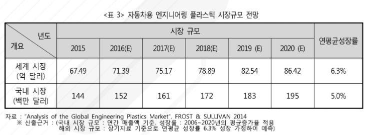

# 자동차용 엔지니어링 플라스틱시장의 미래 시장 규모는?

 Analysis of the Global Engineering Plastics Market(Frost & Sullivan, 2014) 보고서에 따르면, 세계
자동차용 엔지니어링 플라스틱 시장은 2013-2020년 연평균 성장률(CAGR) 5.7%로 성장하여 2015년에
67.49억 달러 규모이고 2020년까지 86.42억 달러에 달할 것으로 예측됩니다. 국내 시장은 2015년 144백
만 달러이었던 시장 규모가 2020년 195백만 달러에 달할 것으로 예상됩니다.

 

## 참고문서
- 27-2016-자동차용 엔지니어링_플라스틱.pdf