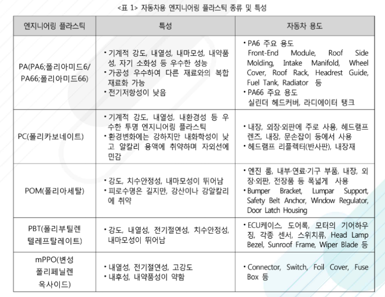

# 자동차용 엔지니어링 플라스틱이란?

엔지니어링 플라스틱(EP; ENPLA, Engineering Plastic)은 구조용 및 기계 부품에 적합한 강도 높은
고성능 엔지니어링 플라스틱으로서 주로 금속대체를 목표로 한 것 또는 자동차 부품이나 기계부품, 전
기, 전자부품과 같은 공업적 용도에 사용되는 플라스틱을 의미합니다. 엔지니어링 플라스틱은 범용과 슈
퍼엔지니어링 플라스틱으로 분류되는데, 범용 엔지니어링 플라스틱의 종류는 폴리아미드(PA), 폴리아
세탈(POM), 폴리카보네이트(PC), 폴리페닐렌 옥사이드(M-PPO), 폴리부틸렌테레프탈레이트(PBT)가 있으
며 통상 5대 엔지니어링 플라스틱으로 구분하여 사용되고 있습니다. 슈퍼엔지니어링 플라스틱(SEP, Super
ENPLA)은 내열성이 확보되어 150°C 이상의 고온에서 장기간 사용할 수 있는 열가소성 수지로 폴리페
닐렌 설파이드(PPS), 폴리이미드(PI), 내열PA(PPA, PA6T, PA9T, PA46) 등이 있고 항공기/자동차 등에
적용하면서 점진적으로 시장 확대를 이루어가고 있습니다. 엔지니어링 플라스틱은 자동차부품 및 전자기기에 적용되면서 금속 시장을 대체해 나갈 수 있을 것
으로 예상되어 차세대 신소재로 엔지니어링 플라스틱의 개발과 생산이 활발히 이루어지고 있습니다. 특히, 각국의 자동차 온실가스배출 및 연비규제가 강화됨에 따라 자동차 경량화 및 친환경차 등의 보급이 
확대되고 있어 자동차 소재로 내구성, 내열성, 전기적 특성 등이 뛰어난 엔지니어링 플라스틱의 사용
이 증가하고 있습니다. 자동차용으로 주로 쓰이는 엔지니어링 플라스틱 중 하나는 폴리아미드이며 폴리아
세탈은 금속을 대체 가능한 물성을 가지고 있어 자동차 경량화에 적합합니다. 절연성을 가지고 있는 엔
지니어링 플라스틱인 폴리부틸렌테레프탈레이트와 내열성, 전기적 특성이 뛰어난 슈퍼 엔지니어링 플
라스틱인 폴리페닐렌 설파이드는 전장화 및 친환경차 등의 보급 확대에 따라 사용량이 증가할 것으로
기대됩니다. 자동차의 Door, Fender, Hood(Bonnet), Quarter panel, Tail gate(Trunk Door/Lid) 등의 외판
과 카시트프레임 등의 구조부재, 창문 유리(뒷유리와 선루프유리)는 5년 이내에 본격적으로 대체될 것
으로 판단됩니다. 

 

## 참고문서
- 27-2016_자동차용_엔지니어링_플라스틱.pdf 