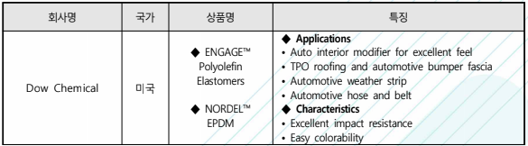
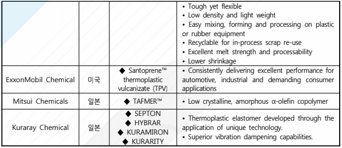

# 자동차용엘라스토머 해외 시장의 시장 크기는?

2014년에 국제 열가소성 엘라스토머 시장은 전체 점유율의 45%를 차지하는 주요 4개 회사들에 의해 주도 되었으며, 주요 회사는 Arkema, Bayer MaterialScience, Dynasol Elastomers, Evonik, Kraton 그리고 Dow Chemical 입니다. 

미국의 Dow Chemical은 ENGATE를 상품명으로 폴리올레핀 엘라스토머를 상품화하여 시판하고 있습니다. 
ExxonMobil Chemical은 ‘EXXPOL'에 대한 메탈로센 촉매 특허권을 보유하고 있으며 중국과 중동의 범용수지 증산에 대응하기 위해 2012년 싱가포르에 30만톤 규모의 메탈로센 엘라스토머 계열의 m-PE 생산 공장을 건설하여 고부가 제품의 시장 확대에 대비하고 있습니다.
Santoprene TPV(Thermoplastic vulcanizate)를 개발하여 완전 가교 타입으로 고무에 근접한 내유성과 내열성을 갖춘 TPV를 자동차의 글래스런 채널, 공구, 건축자재의 소재로 공급하고 있으며 고무와 PVC를 대체하는 소재 시장으로 확대하고 있습니다.

일본의 Mitsui Chemicals사는 TAFMER를 상품명으로 올레핀 계열 엘라스토머를 시판하고 있으며 Kuraray Chemical사는 수첨 스티렌계 엘라스토머(상품명;SEPTON과 HYBRAR), 열가소성 폴리우레탄(상품명;KURAMIRON), 특히 투명성, 내후성, 유연성이 우수한 신규의 아크릴계 열가소성 엘라스토머(상품명;KURARITY)를 시판하고 있습니다. 
수첨 스티렌계 엘라스토머의 올레핀에 대한 우수한 접착성을 유지한 상태로 단점인 각종 극성 재료와의 접착성을 향상시킬 수 있는 신규 제품인 SEPTON K 시리즈를 개발하고 있습니다.

## 참고문서
- 28-2016-자동차용 엘라스토머.pdf