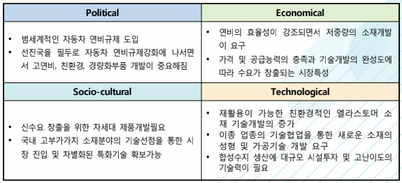

# 자동차용 엘라스토머 시장의 PEST 분석은?

정치적 분석입니다.
범세계적인 자동차 연비규제를 도입했습니다.
선진국을 필두로 자동차 연비규제강화에 나서면서 고연비, 친환경, 경량화부품 개발이 중요해졌습니다.

경제적 분석입니다.
연비의 효율성이 강조되면서 저중량의 소재개발이 요구되었습니다.
가격 및 공급능력의 충족과 기술개발의 완성도에 따라 수요가 창출되는 시장특성을 가지고 있습니다.

사회적 분석입니다.
신수요 창출을 위한 차세대 제품개발이 필요합니다.
국내 고부가가치 소재분야의 기술선점을 통한 시장 진입 및 차별화된 특화기술이 확보 가능합니다.

기술적 분석입니다.
재활용이 가능한 친환경적인 엘라스토머 소재 기술개발이 증가되었습니다.
이종 업종의 기술협업을 통한 새로운 소재의 성형 및 가공기술 개발이 요구됩니다.
합성수지 생산에 대규모 시설투자 및 고난이도의 기술력이 필요합니다.

## 참고문서
- 28-2016-자동차용 엘라스토머.pdf