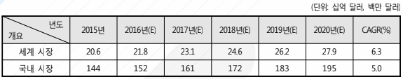

# 자동차용 엘라스토머 시장의 미래시장규모 예측은?

Analysis of the Global Elastomers Market(Frost & Sullivan, 2015) 보고서에 따르면, 국제 엘라스토머 시장은 2015-2021년 연평균 성장률(CAGR) 6.3%로 2015년 20.58억 달러 규모에서 2021년 27.92억 달러 규모로 성장할 것으로 예측됩니다. 
국내 시장은 2014년 144백만 달러이었던 총 시장 규모가 2020년에는 195백만 달러에 이를 것으로 전망됩니다.

## 참고문서
- 28-2016-자동차용 엘라스토머.pdf