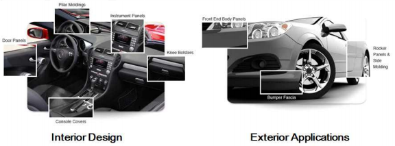

# 자동차용 엘라스토머란?

엘라스토머(Elastomer)는 고무와 플라스틱의 성질을 모두 가진 고부가 합성수지로 자동차용 범퍼 소재, 신발의 충격 흡수층, 기능성 필름, 전선케이블 피복재 등에 사용됩니다. 
엘라스토머는 연비향상을 위한 경량화, 환경규제에 대응할 수 있어 자동차 산업의 핵심부품으로써 차세대 신소재로 주목받고 있습니다. 
그중 열가소성 엘라스토머(TPE, Thermoplastic Elastomer)는 고무의 탄성과 열가소성 플라스틱 수지의 가공성을 발현한 소재로 올레핀계 TPE, 올레핀계 TPV(Thermoplastic Vulcanizate), 스티렌계 TPE, 우레탄계 TPE(TPU), 불소계 TPE, 폴리에스테르계 TPE, PVC계 TPE, 폴리아미드계 TPE 등으로 다양하게 세분화되어 개발되고 있습니다. 
열가소성 엘라스토머 기술에서 주된 개발 관심사는 가공 특성을 개선하고, 설계의 유연성을 향상시키는 것입니다. 
엘라스토머의 가공 특성에 따라 튜브와 웨더스트립, 자동차의 인판넬과 도어트림, 매트가이드, 선루프드레인 호스 등의 광범위한 용도로 자동차 부품 응용에 적용 가능하여 사용 범위를 확장시킬 수 있습니다. 

자동차에 사용되는 엘라스토머는 가장 많은 양이 올레핀계이고, 특수한 성능을 중심으로 폴리에스테르계, 스티렌계, 폴리아미드계 및 불소계가 사용되고 있습니다. 
올레핀계 열가소성 엘라스토머(TPO)는 Hard segment에는 폴리에틸렌, 폴리프로필렌 등의 폴리올레핀계 수지, Soft segment에는 EPDM(Ethylene Propylene Diene Monomer), EPR(Ethylene Propylene Rubber) 등의 올레핀계 고무가 사용되고 있습니다.

자동차 부품 소재로써 엘라스토머는 내장재의 제어부품, 실외용 윈도우트림, 엔진룸 밀폐용 등에 사용되고 있으며 엘라스토머는 열가소성 수지로써의 우수한 가공성 및 재활용성, 높은 탄성을 지닌 경량 소재로, 향후 가황고무를 대체 할 수 있는 소재로 각광받고 있습니다. 
엘라스토머가 자동차용 부품으로 사용되기 위해서 요구되는 물성으로는 내열, 내유, 내가스성을 기본으로 갖추고, 사출과 발포 성형이 가능하여야 하며, 가스와 연료의 발산을 막을 수 있는 특성을 가져야 하며, 최근 재활용성이 추가로 요구되고 있습니다. 
최근 환경문제가 대두되면서 가류고무 EPDM이나 TPVC(Thermoplastic Polyvinylchloride) 대체용으로서 용도 개발이 이루어지고 있습니다.

제조 방법은 블렌드, 동적 가황에 의해 고무성분을 부분 가교 또는 완전 가교하여 고무 탄성을 부여한 가교 형태, 폴리프로필렌과 α-올레핀 등과 공중합 형태로 구분됩니다. 
최근에 메타로센계 촉매에 의해 중합된 열가소성 엘라스토머가 증가하고 있으며 자동차용으로는 내·외장 양쪽으로 사용되고 있습니다.

자동차용 엘라스토머의 활용은 폴리염화비닐(PVC)과 특수 플라스틱과 같은 대체 물질과 경쟁하면서 아시아 태평양이나 세계 여러 지역에서 수요가 급증하고 있어 엘라스토머의 국제 시장은 계속 성장할 것으로 예측되고 있습니다. 
자동차 부품에서 열가소성 엘라스토머로 대체되고 있지만 높은 교체 비용과 부족한 원자재는 시장의 성장을 저해시키는 위험 요소입니다. 
위험요소는 수직적 통합으로 극복해 낼 수 있을 것으로 예상되며 특색 있는 제품들을 취급하는 엘라스토머 판매 업체 간의 통합은 시장 점유율을 높이고 지역 상황을 개선할 수 있는 기회를 만들어 낼 수 있을 것입니다.

## 참고문서
- 28-2016-자동차용 엘라스토머.pdf