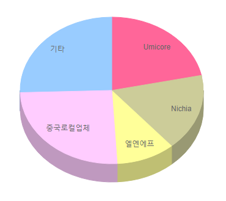

# 자동차용 중대형 이차전지 양극재료 - 해외 시장 규모

중대형 이차전지 양극재 생산 관련 해외시장점유율은 1위 Umicore, 2위 Nichia, 3위 엘엔에프로 나타나며, 3개의 기업의 시장점유율 합이 50% 정도로 경쟁적 산업구조적 특징이 나타납니다.양극재 생산 주요국가를 살펴보면, 중국이 가장 큰 시장을 형성하고 있고, 다음으로는 일본 등의 순으로 시장을 형성하고 있습니다.
중국은 저렴한 인건비, 재료비 등을 기반으로 가격경쟁력이 강하고, 기술선진국과의 기술격차를 빠르게 줄여 성능, 안정성에서 일본 또는 한국제품 수준을 따라잡고 있어 중국이 한국과 일본의 시장을 축소시키는 상황입니다.

## 참고문서
- KISTI 유망아이템 지식 베이스: [http://boss.kisti.re.kr/boss/item/item_print.jsp?unit_cd=PI000005](http://boss.kisti.re.kr/boss/item/item_print.jsp?unit_cd=PI000005)
