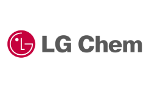
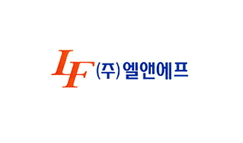

# 자동차용 중대형 이차전지 양극재료 -  국내시장 규모

양극 소재는 LG화학 및 삼성SDI가 in house로 생산을 하고 있으며, 이외에도 엘앤에프신소재, 코스모신소재, 일진머티리얼즈, GS에너지 등이 생산하고 있는 것으로 파악됩니다. 한국 업체들의 시장 점유율이 높은 제품은 자동차용으로 사용이 가능한 NCM 계열 소재이며, 모바일IT에 사용되는 LiCoO2는 상대적으로 시장점유율이 낮고, NCA 소재의 경우 에코프로에서 일부 생산하고 있는 것으로 파악됩니다. 양극재 전구체의 경우 이앤드디, 이앤티, 포스코ESM 등이 생산을 하고 있으며, 양극재 제조업체들이 자체적인 전구체 업체를 진입시키고 있는 것으로 파악됩니다.

## 참고문서
- KISTI 유망아이템 지식 베이스: [http://boss.kisti.re.kr/boss/item/item_print.jsp?unit_cd=PI000005](http://boss.kisti.re.kr/boss/item/item_print.jsp?unit_cd=PI000005)
