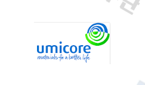
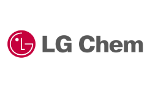
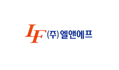

# 자동차용 중대형 이차전지 양극재료 -  주요 참여기업

해외 기업에는 Umicore, Nichia, 엘엔에프, 중국로컬업체 등이 있고, 국내 기업에는 LG화학, 삼성SDI, 엘앤에프신소재, 코스모신소재, 일진머티리얼즈 등이 있습니다.

해외 시장의 중대형 이차전지 양극재 생산 관련 해외시장점유율은 1위 Umicore, 2위 Nichia, 3위 엘엔에프로 나타나며, 3개의 기업의 시장점유율 합이 50% 정도로 경쟁적 산업구조적 특징이 나타납니다. 국내 시장의 양극 소재는 LG화학 및 삼성SDI가 in house로 생산을 하고 있으며, 이외에도 엘앤에프신소재, 코스모신소재, 일진머티리얼즈, GS에너지 등이 생산하고 있는 것으로 파악됩니다.

## 참고문서
- KISTI 유망아이템 지식 베이스: [http://boss.kisti.re.kr/boss/item/item_print.jsp?unit_cd=PI000005](http://boss.kisti.re.kr/boss/item/item_print.jsp?unit_cd=PI000005)
