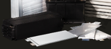

# 자동차용 중대형 이차전지 양극재료 시장의 국내 주요 업체는?

국내 기업에는 LG화학, 삼성SDI, 엘앤에프신소재, 코스모신소재, 일진머티리얼즈 등이 있습니다.

'LG화학'의 기업 형태는 상장, 대기업(14,280명, 2015월 12월 기준)이며 영업 이익률은 5.76% (2014년 기준, 전지가 차지하는 매출비중은 약 15%)입니다.
사업 영역은 기초소재, 전지(모바일용, 전기자동차용), 정보전자소재, 재료 등이 있으며, 
배터리연구소 활동으로는 전지소재개발(고용량 3성분계 양극재 개발, Si계 고용량 음극재 개발, 고안전성 분리막 개발, 고기능성 전해액 개발), 전력저장용전지 개발, 자동차용전지 선행개발(2세대 고에너지 밀도 BEV셀 개발, GM향 적용 추진 등이 있습니다.

'엘앤에프신소재'의 기업형태는 대기업(192명, 2015년 12월 기준)이며, 영업이익률은 2.14% (2014년 기준)입니다.
사업영역은 전지재료사업, 전자소재사업 등이 있으며, 주요상품으로는 축전지재료 (2차전지용 양극활물질), 기초화합물 제조 등이 있습니다.

## 참고문서
- KISTI 유망아이템 지식 베이스: http://boss.kisti.re.kr/boss/item/item_print.jsp?unit_cd=PI000005