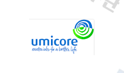
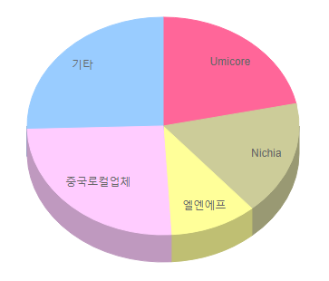

# 자동차용 중대형 이차전지 양극재료 -  해외 주요 기업

해외 기업에는 Umicore, Nichia, 엘엔에프, 중국로컬업체 등이 있습니다. 중대형 이차전지 양극재 생산 관련 해외시장점유율은 1위 Umicore, 2위 Nichia, 3위 엘엔에프로 나타나며, 3개의 기업의 시장점유율 합이 50% 정도로 경쟁적 산업구조적 특징이 나타납니다.

## 참고문서
- KISTI 유망아이템 지식 베이스: [http://boss.kisti.re.kr/boss/item/item_print.jsp?unit_cd=PI000005](http://boss.kisti.re.kr/boss/item/item_print.jsp?unit_cd=PI000005)
