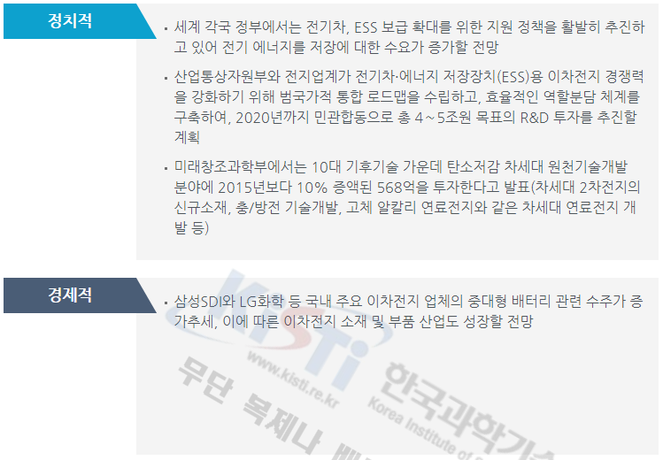
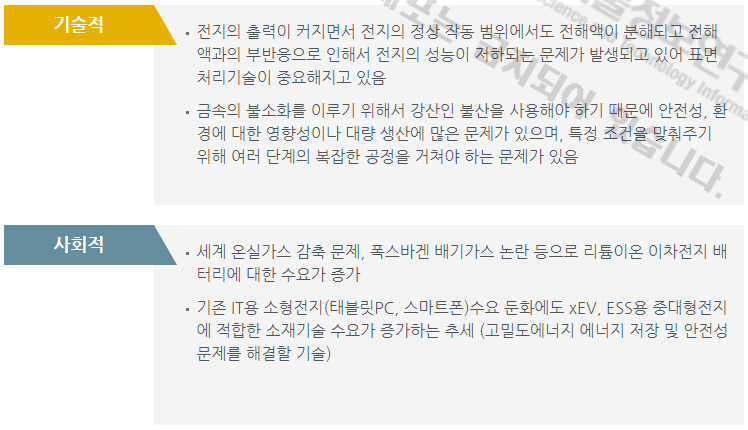
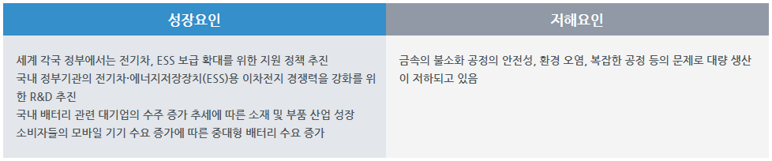

# 자동차용 중대형 이차전지 양극재료 - PEST 분석

정치적 분석입니다. 세계 각국 정부에서는 전기차, ESS 보급 확대를 위한 지원 정책을 활발히 추진하고 있어 전기 에너지를 저장에 대한 수요가 증가할 전망입니다. 그리고 산업통상자원부와 전지업계가 전기차·에너지 저장장치(ESS)용 이차전지 경쟁력을 강화하기 위해 범국가적 통합 로드맵을 수립하고, 효율적인 역할분담 체계를 구축하여, 2020년까지 민관합동으로 총 4∼5조원 목표의 R&D 투자를 추진할 계획입니다. 또한 미래창조과학부에서는 10대 기후기술 가운데 탄소저감 차세대 원천기술개발 분야에 2015년보다 10% 증액된 568억을 투자한다고 발표(차세대 2차전지의 신규소재, 충/방전 기술개발, 고체 알칼리 연료전지와 같은 차세대 연료전지 개발 등)했습니다.

경제적 분석입니다. 삼성SDI와 LG화학 등 국내 주요 이차전지 업체의 중대형 배터리 관련 수주가 증가추세, 이에 따른 이차전지 소재 및 부품 산업도 성장할 전망입니다.

기술적 분석입니다. 전지의 출력이 커지면서 전지의 정상 작동 범위에서도 전해액이 분해되고 전해액과의 부반응으로 인해서 전지의 성능이 저하되는 문제가 발생되고 있어 표면처리기술이 중요해지고 있습니다. 또한 금속의 불소화를 이루기 위해서 강산인 불산을 사용해야 하기 때문에 안전성, 환경에 대한 영향성이나 대량 생산에 많은 문제가 있으며, 특정 조건을 맞춰주기 위해 여러 단계의 복잡한 공정을 거쳐야 하는 문제가 있습니다.

사회적 분석입니다. 세계 온실가스 감축 문제, 폭스바겐 배기가스 논란 등으로 리튬이온 이차전지 배터리에 대한 수요가 증가하고 있습니다. 그리고 기존 IT용 소형전지(태블릿PC, 스마트폰)수요 둔화에도 xEV, ESS용 중대형전지에 적합한 소재기술 수요가 증가하는 추세 (고밀도에너지 에너지 저장 및 안전성 문제를 해결할 기술)입니다.

## 참고문서
- KISTI 유망아이템 지식 베이스: [http://boss.kisti.re.kr/boss/item/item_print.jsp?unit_cd=PI000005](http://boss.kisti.re.kr/boss/item/item_print.jsp?unit_cd=PI000005)
