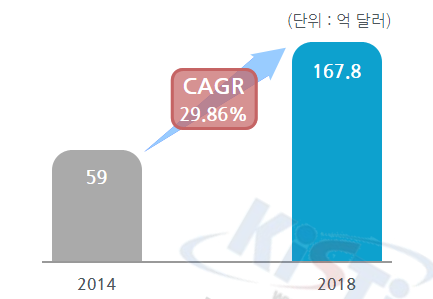
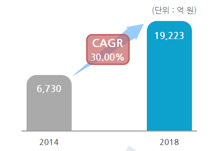

# 자동차용 중대형 이차전지 양극재료의 성장률

양극재(Cathode)는 전기차 배터리 성능의 4대 소재 중 하나이므로, 양극재를 포함하는 중대형 이차전지의 해외시장규모는 2014년 59억 달러에서 2018년 167.8억 달러로 증가, 연평균 29.86%의 증가율을 보일 전망입니다.

그리고 양극재(Cathode)는 전기차 배터리 성능의 4대 소재 중 하나이므로, 양극재를 포함하는 중대형 이차전지의 국내시장규모는 2014년 6,730억 원에서 2018년 19,223억 원으로 증가, 연평균 30.0%의 증가율을 보일 전망입니다.

## 참고문서
- KISTI 유망아이템 지식 베이스: http://boss.kisti.re.kr/boss/item/item_print.jsp?unit_cd=PI000005