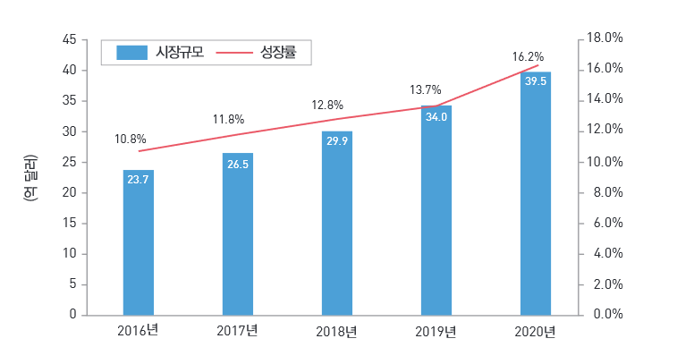

# 주차 보조 시스템의 해외시장의 크기는?
주차 보조 시스템의 세계 시장 규모는 조사 기관에 따라 규모와 범위에 있어 다소 차이가 있을 수 있으나, 
향후 5 년간 연평균 성장률(CAGR) 10.8%씩 성장하여 2016년 23.7억달러에서 2020년에는 39.5억 달러 규모에 이를 것으로 전망하고 있습니다.

## 참고문서
- KISTI 마켓리포트: http://kmaps.kisti.re.kr/rpt/findAllFile.do?rptId=2381&metaTypeCd=&metaTypeSeq=&reportGubun=1