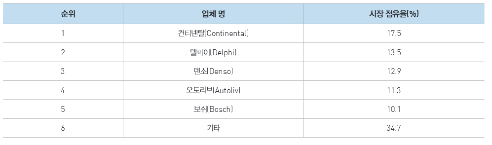

# 주차 보조 시스템 - 시장 점유율

주요 주차 보조 시스템의 상위 5개의 기업이 60%가 넘는 점유율을 차지하고 있음을 알 수 있습니다.
최근 자동차 부품업체들의 협조와 기술 없이는 완성차에 대한 품질확보와 경쟁력 유지가 어렵기에 부품업체들의 영향력이 확대대고 있습니다.
컨티넨탈, 델파이, 덴소와 같은 부품업체들은 자동차 운전자에 대한 지원기술의 센싱(인식)및 제어에 집중하고 있었으나 최근 ECU 통합시스템 개발을 적극적으로 추진하고 있습니다.
독일의컨티넨탈은 17.5%의 점유율을 가지며 최근 수 년 동안 수위자리를 지키고있습니다. 유럽, 아시아등 모든 지역에서 가장 높은 점유율을 보입니다. 영국의 델파이(Delphi)는 13.5%로 2위이며 그뒤를 일본의 덴소, 오토리브(Autoliv), 보쉬(Bosch)등이 뒤따릅니다.

## 참고문서
- KISTI 마켓리포트: [http://kmaps.kisti.re.kr/rpt/findAllFile.do?rptId=2381&metaTypeCd=&metaTypeSeq=&reportGubun=1](http://kmaps.kisti.re.kr/rpt/findAllFile.do?rptId=2381&metaTypeCd=&metaTypeSeq=&reportGubun=1)
