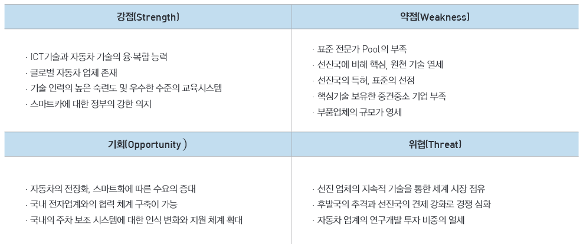

# 주차 보조 시스템을 SWOT 분석하면?
국내 주차 보조 시스템을 비롯한 첨단 운전자 보조 시스템(ADAS ,  Advanced Driver Assist System) 산업은 유럽, 미국, 일본 등의
기술 선진국을 추격하고 있는 Fast Follower 입장에 있습니다. 또한 중국의 추격이 만만치 않은 것이 현실입니다.
최근에는 자동차의 지능형 시스템 산업에 있어서 핵심기술을 보유한 부품업체들이 산업을 견인하는 것도 또 하나의 특징입니다. 
때문에 현재 국내 완성차 주도 자동차산업 생태계로부터의 변화가 필요합니다.
즉 중소·중견기업 주도의 사업 아이템을 발굴하고 국내외 복수의 수요기업에 납품 가능한 새로운 R&D 협력모델이 요구됩니다.
이러한 주차 보조 시스템을 SWOT 분석하면 강점으로는  ICT 기술과 자동차 기술의 융·복합 능력, 글로벌 자동차 업체 존재, 기술 인력의 높은 숙련도
및 우수한 수준의 교육시스템, 스마트카에 대한 정부의 강한 의지가 있습니다.
약점으로는 표준 전문가 Pool의 부족, 선진국에 비해 핵심 원천 기술 열세, 선진국의 특허와 표준의 선점, 핵심기술 보유한 중견중소 기업 부족
, 부품업체의 규모가 영세하다는 것이 있습니다.
기회로는 자동차의 전장화, 스마트화에 따른 수요의 증대 , 국내 전자업계와의 협력 체계 구축이 가능, 국내의 주차 보조 시스템에
대한 인식 변화와 지원 체계 확대가 있습니다.
위협으론 선진 업체의 지속적 기술을 통한 세계 시장 점유, 후발국의 추격과 선진국의 견제강화로 경쟁 심화, 자동차 업계의 연구개발 투자 비중의 열세가 있습니다. 

## 참고문서
- KISTI 마켓리포트: http://kmaps.kisti.re.kr/rpt/findAllFile.do?rptId=2381&metaTypeCd=&metaTypeSeq=&reportGubun=1

