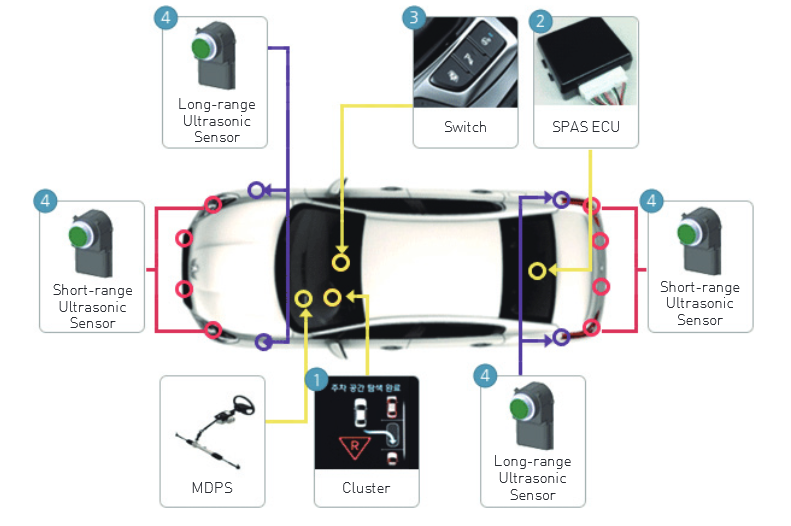

# 주차 보조 시스템이 무엇인가?
주차 보조 시스템은 운전자가 쉽고 편리하게 차량을 주차할 수 있도록 도와주는 시스템으로 차량에 장착된 센서를 통해 주차 공간을 탐색하고, 
탐색된 공간에 차량을 주차할 수 있는 최적의 경로 값을 계산합니다. 
계산된 경로 값에 따라 차량의 조향훨을 자동으로 제어하여 최적의 경로로 
주차가 이루어지도록 유도하는 운전자 중심의 편의 시스템을 말합니다. 
이러한 주차 보조 시스템은 주차 공간 탐색방식, 주차 제어방식 등 주차 기능에 따라 다양하게 출시되고있습니다.

## 참고문서
- KISTI 마켓리포트: http://kmaps.kisti.re.kr/rpt/findAllFile.do?rptId=2381&metaTypeCd=&metaTypeSeq=&reportGubun=1
