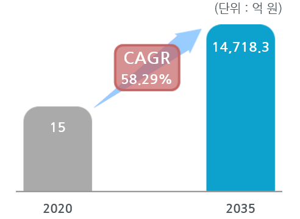

# 자율주행시스템의 국내시장의 시장의 크기는?
국내 자율주행 자동차용 인공지능 모 듈 시장은  2013 년  6.8 억 원 , 2015 년  15.7 억 원에서  2020 년  194.7 억 원으로 연평균  65.6%  성장할 전망입니다.
 

## 참고문서
- KISTI 마켓리포트 : http://kmaps.kisti.re.kr/rpt/findAllFile.do?rptId=2304&metaTypeCd=&metaTypeSeq=&reportGubun=1
- KISTI 유망아이템 지식 베이스: http://boss.kisti.re.kr/boss/item/item_print.jsp?unit_cd=PI000327
