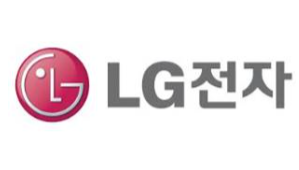
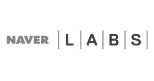

# 자율주행시스템 - 국내 주요 업체

대표적으로 LG전자와 네이버랩스가 있습니다.
LG전자의 경우 자동차부품사업부를 통해 인포테인먼트 개발은 물론 LG화학, 디스플레이 등 자회사와 협력하여 자율주행을 위한 부품개발, 제조, 공급 중에 있습니다.

그동안 인포테인먼트 부품을 집중 육성해온 LG전자는 고부가가치 제품인 전기차, 커넥티드카, 자율주행차 연구개발에 박차를 가하고 있으며, 특히 주행 안정성을 높여주는 ADAS 솔루션 개발에 집중하고 있습니다
LG전자의 다음 전략은 미래 스마트카용 전장부품 확대를 통해 자동차 전장부품 경쟁력을 더욱 확대해나가는 것이며, 이를 위해 LG전자는 IVI사업부와 ADAS 사업을 통합해 카인포테인먼트를 총괄하는 스마트사업부를 신설하였고, 편의장치를 넘어 주행에 직접 관여하는 자율주행 안전장치를 개발하겠다는 의지를 보이고 있습니다.

네이버는 2017년 서울모터쇼에 참가하여 토요타 프리우스를 기반으로 제작한 자율주행차, 3D기반 실내외지도, 스마트 모빌리티 분야 핵심 기술 등을 발표하였고, 인공지능 및 인지기술을 기반으로 제작된 자사의 자율주행차를 통해 도로 위의 사물 및 위치ㆍ경로 파악 등 NHTSA Level 3에 해당하는 기술을 시연하기도 했습니다.

또한, 차량 운전자에 최적화된 인포테인먼트 플랫폼 시연을 통해 자율주행차와
시대에 운전자 편의성 제고를 위해 제공해야 할 서비스 가이드라인을 제시하였습니다.

## 참고문서
- KISTI 마켓리포트 : [http://kmaps.kisti.re.kr/rpt/findAllFile.do?rptId=2304&metaTypeCd=&metaTypeSeq=&reportGubun=1](http://kmaps.kisti.re.kr/rpt/findAllFile.do?rptId=2304&metaTypeCd=&metaTypeSeq=&reportGubun=1)
- KISTI 유망아이템 지식 베이스: [http://boss.kisti.re.kr/boss/item/item_print.jsp?unit_cd=PI000327](http://boss.kisti.re.kr/boss/item/item_print.jsp?unit_cd=PI000327)
