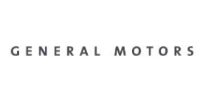
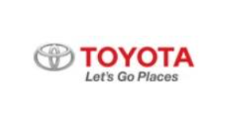

# 자율주행시스템 시장의 해왜 주요 업체는 어떤게 있는지?
 해외 업체 동향으로는 GM, toyota가 있다.
  GM은 `16년 유명 자율주행 스타트업 Cruise Automation 인수 및 차량 공유회사 Lyft 인수와 IBM Watson 도입, 자사 플랫폼 On star go 탑재를 통해 데이터 수집/분석을 진행하고 있습니다.

 
  
  도요타는 운전 중 자동차 주변의 위험요소를 파악하고 운전자가 이를 발견 혹은 인지하고 있는지 여부를 파악하는 소프트웨어 시스템을 개발하여 테스트하고 있습니다.
  Guardian이라 명명된 이 시스템은 로봇 공학 및 자율주행과 관련한 연구를 수행하기 위한 2015년 설립된 연구조직인 Toyota Research Institute 내 자율주행 파트에서 2016년부터 개발을 시작하였습니다.
이 시스템은 자동차 외부 레이더 및 기타 센서를 통해 차량 주변 상황을 모니터링 하고 카메라는 운전자의 머리 움직임과 시선을 추적할 수 있습니다.

 

## 참고문서
- KISTI 마켓리포트 : http://kmaps.kisti.re.kr/rpt/findAllFile.do?rptId=2304&metaTypeCd=&metaTypeSeq=&reportGubun=1
- KISTI 유망아이템 지식 베이스: http://boss.kisti.re.kr/boss/item/item_print.jsp?unit_cd=PI000327

