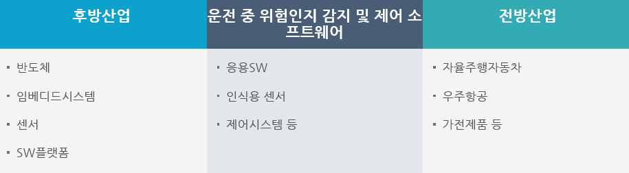

# 자율주행시스템 시장의 전후방 산업구조는?
운전 중 위험인지 및 제어 소프트웨어 기술과 같은 운전자지원시스템 기술은 전방 및 후방 모두에 산업파급효과가 큰 수준이며, 국내 기술은 아직 초기 시장진입 단계이나, 신차안전도프로그램의 시행으로 향후 2~3년 안에 시스템을 관장하는 대기업을 중심으로 급속히 시장이 성장할 전망입니다.
전방산업은 우주항공, 자율주행 자동차 등이 있으며, 운전자지원시스템 산업에 비중이 높은 산업으로는 우주항공이 30%로 가장 높으며, 국방 30%, 가전 20%, 산업용 기계류 20%순으로 비중을 차지하고 있어 세계 운전자지원시스템 산업은 우주항공 산업의 영향을 많이 받고 있는 추세입니다.
후방산업은 반도체, 임베디드시스템, 센서, SW플랫폼 분야로 구성되어 있습니다.

## 참고문서
- KISTI 마켓리포트 : http://kmaps.kisti.re.kr/rpt/findAllFile.do?rptId=2304&metaTypeCd=&metaTypeSeq=&reportGubun=1
- KISTI 유망아이템 지식 베이스: http://boss.kisti.re.kr/boss/item/item_print.jsp?unit_cd=PI000327

