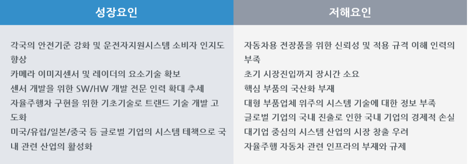

# 자율주행시스템 - PEST 분석

성장요인으론 각국의 안전기준 강화 및 운전자지원시스템 소비자 인지도 향상하였고
카메라 이미지센서 및 레이더의 요소기술 확보하였습니다.
센서 개발을 위한 SW/HW 개발 전문 인력 확대하는 추세이고
자율주행차 구현을 위한 기초기술로 트랜드 기술 개발 고도화하고 있습니다.  
미국/유럽/일본/중국 등 글로벌 기업의 시스템 테책으로 국내 관련 산업의 활성화하고 있습니다.
저해요인으로는 자동차용 전장품을 위한 신뢰성 및 적용 규격 이해 인력의 부족하고
초기 시장진입까지 장시간 소요됩니다.
핵심 부품의 국산화 부재이고
대형 부품업체 위주의 시스템 기술에 대한 정보 부족하며
글로벌 기업의 국내 진출로 인한 국내 기업의 경제적 손실이 있습니다.
대기업 중심의 시스템 산업의 시장 창출 우려되고
자율주행 자동차 관련 인프라의 부재와 규제가 있습니다.
정치적으로 미국, 유럽, 일본 등 기술선진국은 민간기업과 정부가 협력하여 자율주행차의 조기완성을 위해 R&D, 테스트베드, 법제도 정비 등 모든 방면을 공동 추진 중이고
미국, 일본 등 선진국은 자율주행차의 자유로운 도로테스트를 위해 상기와 같은 규정을 규제로 간주하여 완화 중이며, 추가 규제 발굴을 위해 노력 중입니다.
또한, NHTSA에서 발표한 자율주행차 5단계에 따라 사고에 대한 책임여부가 이미 정립되어 있으나 국내 학계에서는 여전히 책임 주체에 대하여 논쟁 중이기도 합니다.
경제적으로는 GM, 포드, BMW, 토요타, 닛산, 볼보 등 세계적인 자동차 완성업체는 IBM, MS 등 ICT기업과 협력ㆍ인수하거나 연구소 설립 등 해당기술에 집중투자 중
ICT/자동차 융합 세계시장은 2010년 1,200억 달러에서 2015년 2,000억 달러로 연평균 10.8%로 급성장할 것으로 전망되며 그 후 2020년까지 2,700억 달러로 연평균 6.2%로 증가할 것으로 전망됩니다.
국내의 경우 ICT/자동차 융합 시장은 2010년 7.5조원에서 2020년 30조원으로 성장할 전망입니다.
기술적으로 국내 자율주행차 산업은 현대ㆍ기아자동차 등 완성업체 독자적으로 기술개발이 이뤄지고 있으며, ICT기업 또한, 별도의 협업 없이 자체적으로 개발 추진 중
한국의 경우 Smart Highway 프로젝트(국토해양부를 중심으로 V2X를 구현하기 위한 인프라 구축, 센서 개발, 통신기술, 제어기술 등을 산학연에서 공동 개발) 및 산업원천과제로 V2X 관련 기술을 개발해오고 있으나 초기단계입니다.
일본은 ITS-Safety 2010 프로젝트(정부-업체 협업으로 이루어지며 DSSS는 경찰청을 중심으로 일반도로에서의 V2I 기술을 개발, Smartway는 국토교통성을 중심으로 DSRC 기술 기반 다매체 통합 플랫폼 기술을 개발, ASV는 국토교통성의 자동차교통국을 중심으로 차량간, 보행자-차량 간, 차량-인프라 간 통신 및 서비스 기술 개발) 진행 중입니다.
사회적으로는 자동차제조사, 자동차부품제조사, ICT업체들 간의 융합기술 개발이 활발히 전개 중으로 특히 IT/자동차 핵심기술 관련 중견/중소기업을 집중 육성함으로써 산업 육성 효과를 발생시킬 수 있습니다.

## 참고문서
- KISTI 마켓리포트 : [http://kmaps.kisti.re.kr/rpt/findAllFile.do?rptId=2304&metaTypeCd=&metaTypeSeq=&reportGubun=1](http://kmaps.kisti.re.kr/rpt/findAllFile.do?rptId=2304&metaTypeCd=&metaTypeSeq=&reportGubun=1)
- KISTI 유망아이템 지식 베이스: [http://boss.kisti.re.kr/boss/item/item_print.jsp?unit_cd=PI000327](http://boss.kisti.re.kr/boss/item/item_print.jsp?unit_cd=PI000327)
