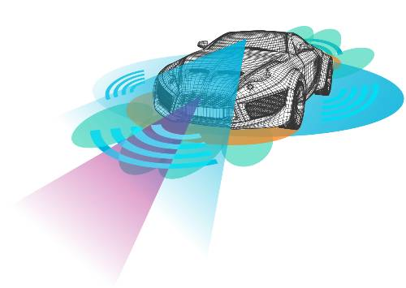

# 자율주행시스템이란?

자동차용 인공지능 모듈에는 기계 학습 ,  자연어 처리 ,  이미지 처 리 ,  음성 인식 등의 모듈이 있습니다 .  자동차용 인공지능 (AI, Artificial  Intelligence)  시스템은 라이다 (Lidar)  센서 ,  레이더 ,  초음파 센서 (Sensor),  적외선 카메라 ,  모노 / 스테레오 카메라 등을 자동차 내외부 에 설치하고 이러한 센서 등을 통해 외부 정보를 수집하여 분석한 후 자동차 스스로 주변 환경을 인식하여 위험한 상황을 판단하고 주행 경로를 계획하는 등 운전자의 주행조작을 최소화하며 ,  스스로 안전 한 주행이 가능하도록 해주는 시스템입니다 .  자율주행 자동차용 인공지능 시스템에는 라이다 센서 ,  레이더 ,  카 메라 등을 활용하여 주변 상황을 정확히 파악하는 기술 ,  차량 주변 센 서 로 파악하기 어려운 차량과 차량 ,  차량과 도로에 설치된 센서와 통 신을 통해 정보를 교환하고 위험 여부를 종합적으로 판단하는 기술 ,  운전자와 자동차와의 교감을 통해 자율주행에 관한 신뢰성을 확보하 고 위험 상황에 운전자가 적절히 대응할 수 있는 기술 및 제어 오류 발생에 대응하는 기술 등이 필요합니다 .  완전 자율주행 자동차는 운전자의 운전조작이 전혀 없이 자동차 스스로 주행환경을 인식하여 목 표지점까지 운행함에 따라 운전자의 부주의로 인한 교통사고를 미연 에 예방하고 ,  편리한 운전 환경을 제공합니다.  자율주행 자동차의 핵심은 인공지능 시스템이며 ,  구글 등 관련자 동차 업계에서는 인공지능 시스템을 자율주행 자동차에 적용하여 시 장을 선점하기 위해 막대한 투자를 진행하고 있다 .  구글은  300 만  km 를 상회하는 테스트 주행을 통해 축적된 빅 데이터를 활용하여 머신 러닝 (Machine Learning) 으로 인공지능 시스템의 성능을 개선하고 있습니다.   

## 참고문서
- KISTI 마켓리포트 : http://kmaps.kisti.re.kr/rpt/findAllFile.do?rptId=2304&metaTypeCd=&metaTypeSeq=&reportGubun=1
- KISTI 유망아이템 지식 베이스: http://boss.kisti.re.kr/boss/item/item_print.jsp?unit_cd=PI000327
