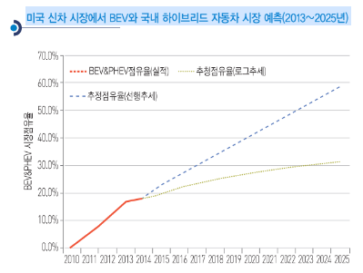

# 전기자동차(고연비그린자동차)의 해외시장 크기는?

공격적인 규제가 계획된 미국의 연비 기준 계획을 고려해도 미국 전기 자동차의 점유율은 향후 10년간 현재 3배 수준의 규모 확대가 기대되었을 뿐입니다.
최근 10년간 미국에서 전체 신차 시장 규모가 0.5%로 거의 성장하지 못한 점을 감안하면, 향후 10년 후 전기 자동차 시장 규모는 현재의 3배로 성장한다고 볼 수 있고, 향후 10년 후 미국 전기 자동차의 시장규모는 180만 대 수준으로 예상됩니다.
그러나 이런 더딘 성장에도 불구하고 전기 자동차 시장에서 주목해야할 변화가 있는데, 바로 PHEV나 BEV의 점유율 확대 경향입니다.
PHEV는 플러그로 충전한다는 측면에서 BEV와 같지만, 충전 가능한 배터리로 주행하다 방전되면 기존 HEV처럼 엔진과 전기를 함께 사용합니다. 
BEV는 전기 외 별도 동력이 없는 순수 전기 자동차입니다. 
이들 차종은 아래 그래프에 나타난 것과 같이 2010년 미국 신차 중 EV 시장이 차지하는 비중은 0.1%에 지나지 않아 HEV에 크게 밀렸지만, 2014년 5월 현재는 18%까지 EV 시장이 확대되었습니다.
EV 시장에서 HEV 시장을 점차 대체해 나아가고 있는 것입니다.

## 참고문서 
- 13-2014-전기자동차(고연비 그린자동차).pdf