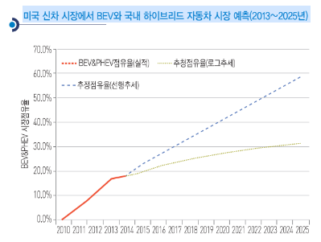

# 전기자동차(고연비그린자동차)의 미래시장규모 예측

최근 BEV와 PHEV의 성장세를 고려, 향후 미국 EV 시장에서 두 차종이 차지하게 될 비중을 추정한 결과가 위의 그래프에 제시되었습니다. 
먼저 최근 3년간의 추세를 그대로 반영한 선형 추세모형에 따르면 2025년에는 EV 시장의 60% 가까이를 BEV와 PHEV가 차지할 것으로 예상되었습니다. 
그러나 최근 BEV의 성장세가 다소 주춤한 경향을 고려해 로그 추세 모형으로 분석한 결과에 따르면 2025년에는 30%를 상회하는 수준까지 시장이 확대될 것으로 예상되었습니다. 
두 모형에 따라 예측 결과는 차이가 있지만 HEV 시장의 상당 부분이 PHEV나 BEV로 대체될 것으로예상됩니다.
기업 입장에서는 높은 연비 규제에 대응하기 위해서 PHEV나 BEV가 HEV보다 유리하는 점도 기억할 필요가 있습니다.

물론 연비 기준 향상에 따른 EV 시장의 성장은 외부적인 도전을 받게 될 수 있습니다. 
1980년대 미국에서는 경기 활성화를 위한 자동차 산업 육성 정책이 힘을 받으면서 CAFE의 기준이 27.5mpg에서 26mpg로 하향 조정된 경험도 있었습니다. 
미래에도 미국 자동차 산업의 경쟁력과 시장의 변화에 따라서 앞서 제시된 기준이 변화될 수도 있습니다. 
그러나 미국의 환경규제가 전방위로 확대되고 있기 때문에 현재 단계에서 갑작스런 완화를 기대하기는 힘듭니다. 
오히려 국내 시장에서 국내 생산 기업의 반발로 저탄소차협력금제도 도입의 재검토가 공론화되는 등 미국 시장보다는 국내 시장에서 EV 시장 활성화를 위한 제도 도입이 늦어지고 있기 때문에 국내 시장에서 HEV나 PHEV의 점유율 확대는 쉽지 않은 상황입니다.
다른 여러 가지 영향 요인을 검토해야겠지만 국내 시장의 EV 시장 활성화를 위해서는 미국과 같은 친환경(고연비) 국가정책에 의한 노력이 절실합니다.

## 참고문서 
- 13-2014-전기자동차(고연비 그린자동차).pdf