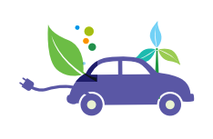

# 전기자동차 - 개념

그린 자동차(Green Vehicle)는 친환경 자동차(Environmentally Friendly Vehicle)로 불리기도 하는데, 대체연료를 포함해 하이브리드 자동차(이하 HEV), 전기 동력 자동차(PHEV(플러그인 하이브리드 자동차) 또는 BEV(배터리 전기 자동차)), 천연가스 자동차, 클린 디젤 자동차와 같이 기존 엔진보다 친환경적으로 발전된 기술이 적용된 자동차를 말합니다.

## 참고문서
-  BOSS Report: 13-2014-전기자동차(고연비 그린자동차).pdf
