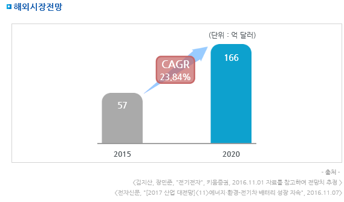

# 전기차용 대형 배터리팩 해외 시장의 시장 크기는?

전기차 배터리 해외시장규모는 2015년 57억 달러에서 2020년 166억 달러로 증가, 연평균 23.8%의 성장률을 보일 전망입니다.  
글로벌 배터리 시장은 전기자동차 등 중대형 시장 위주로 가파른 성장이 예상되는 가운데 전기차·ESS 중심으로 배터리 시장은 크게 성장할테지만 중국의 자국 시장 보호 정책에다 글로벌 완성차 업체까지 자체 배터리 생산을 모색하고 있어 향후 시장 상황은 좋다고만 볼 수 없는 실정이므로 글로벌 경쟁에서 우위를 점할 기술, 가격 등 시장 경쟁력을 높이는데 주력해야 할 것입니다.

## 참고문서
- KISTI 유망아이템 지식 베이스: http://boss.kisti.re.kr/boss/item/item_print.jsp?unit_cd=PI000007