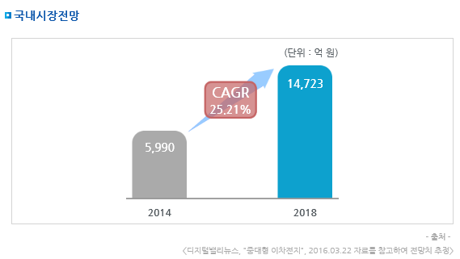

# 전기차용 대형 배터리팩 국내 시장의 시장 크기는?

국내시장규모의 경우 전기차용 대형 배터리팩에 대한 시장 규모 및 전망 자료 확보에 어려움이 있어 전기차용 배터리로 주로 
중대형 이차전지가 사용되므로, 중대형 이차전지에 대한 시장을 살펴보았으며, 전기차용 중대형 이차전지의 국내시장규모는 
2014년 5,990억 원에서 2018년 1조 4,723억 원으로 증가, 연평균 25.2%의 증가율을 보일 전망입니다.

## 참고문서
- KISTI 유망아이템 지식 베이스: http://boss.kisti.re.kr/boss/item/item_print.jsp?unit_cd=PI000007