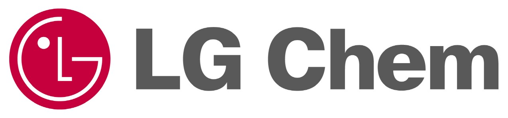

# 전기차용 대형 배터리팩 - 국내 주요 기업

전기차용 대형 배터리팩 시장의 국내 주요 업체는 LG화학과 솔브레인이 있습니다.

LG화학은 영업이익률이 5.76% (2014년 기준, 전지가 차지하는 매출비중은 약 15%) 입니다.
사업영역은 기초소재, 전지(모바일용, 전기자동차용), 정보전자소재, 재료입니다. 배터리연구소 활동은 전지소재개발(고용량 3성분계 양극재 개발, Si계 고용량 음극재 개발, 고안전성 분리막 개발, 고기능성 전해액 개발), 전력저장용전지 개발, 자동차용전지 선행개발(2세대 고에너지 밀도 BEV셀 개발, GM향 적용 추진입니다.
글로벌 자동차 기업의 HEV, PHEV와 EV까지 모든 친환경 차량에 최적화된 전지를 공급하며 하이브리드차(HEV)용 (마이크로 HEV, 순수 HEV), 플러그인하이브리드차(PHEV)용, 전기차(EV)용 으로 나뉩니다. 적용사례로는 그랜져/K7 하이브리드, 쏘나타/K5 하이브리드, 쏘나타 PHEV(현대/기아차), Chevloret Volt(GM), Fluence(르노), Focus(FORD), S60L, XC90(Volvo) 가 있습니다.

솔브레인은 코스닥상장, 대기업 (965명, 2015년 12월 기준) 으로 영업이익률이 12.76% (2014년 기준)입니다.  
솔브레인(주)는 국내의 주요 반도체, 디스플레이, 2차 전지 제조사에 제품을 공급하고 있는 기업으로, 전기차용 전해액 양산 공급을 시작했습니다.
사업영역으로는 반도체재료, 디스플레이재료, 2차전지재료, 전자재료가 있습니다.  
2015년 하반기부터 전기차용 전해액 부문에 본격적으로 진출, 주요 고객사인 SK이노베이션의 기아 소울EV 및 중국 배터리 공급에 이어 다임러사, 벤츠의 2017년 전기차 모델에 셀 공급하기로 되어, 물량 증가가 활발할 전망입니다.

## 참고문서
- KISTI 유망아이템 지식 베이스: [http://boss.kisti.re.kr/boss/item/item_print.jsp?unit_cd=PI000007](http://boss.kisti.re.kr/boss/item/item_print.jsp?unit_cd=PI000007)
