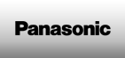
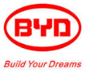

# 전기차용 대형 배터리팩 시장의 해외 주요 업체는?

    전기차용 대형 배터리팩 시장의 해외 주요 업체로는 Panasonic과 BYD가 있습니다. 
Panasonic은 소니와 더불어 양강 체계를 이루는 일본의 대중적인 전자제품 메이커로, 경영의 신이라 불리우는 마쓰시타 고노스케가 세운 전자기업이며 원래 그의 성을 따서 마쓰시타 전기로 불렸으나 2008년에 최종적으로 파나소닉으로 변경되었습니다. 
매출액은 7.5조엔（2016년 3월) 이며 영업이익은 4,157억엔 (2016년 3월)입니다. 

2011~2012년 총 16조원 규모의 적자를 내면서 무너질 위기였던 일본 파나소닉이 최근 테슬라의 보급형 전기차 '모델 3' 예약 호조로 활짝 웃고 있습니다. 파나소닉 배터리를 쓴 테슬라의 고성능 세단 '모델 S'가 2015년에 약 5만대 팔리면서 파나소닉 점유율 향상을 견인, 전기차 배터리 출하량 5550㎿h(메가와트시·전기차로는 약 5만~6만대 규모)로 전 세계 전기차 배터리 시장점유율 1위(36%)에 올랐습니다. 
파나소닉은 생산 능력 확대도 준비하고 있어, 현재 테슬라와 함께 5조원을 들여 미국 네바다주(州)에 배터리와 전기차를 생산할 수 있는 공장 '기가 팩토리'를 짓고 있습니다. 또한 하이브리드, 플러그인 하이브리드, 전기차 등의 글로벌 수요 증가에 대응한다는 복안으로 중국 다롄에 대지면적 약 17만㎡ 규모의 전기차 리튬이온 배터리 공장을 설립하고, 2018년 3월말 가동할 계획입니다.

중국의 광둥성 선전시에 자리를 잡고 1995년 설립된 BYD(비야디자동차, 比亞迪주식유한공사)는 중국의 토종 자동차 제조사로 중국에서는 제2의 테슬라자동차가 될 기업으로 평가되는 업체입니다. 주요 사업부문은 자동차 제조를 비롯해 핸드폰 부품 생산 및 조립, 2차 전지 등이 있으며, 특히 배터리 사업을 기반으로 시작한 신재생에너지 자동차 제조부문에서는 중국 최고의 선두기업으로 꼽히고 있는 가운데 BYD의 매출은 해가 지날수록 급증, 2013년에는 그 전년도보다 12%, 2014년도에는 10%가 증가한 것으로 나타나고 있으며 작년에는 영업이익에서 흑자전환을 기록한 것으로 알려져 있습니다.

판매대수로 글로벌 1위 전기차 업체로 올라선 BYD가 중국 정부의 신에너지차 보조금 축소정책에 따라 신에너지차와 배터리 비용을 대폭 절감키로 하였습니다. 
BYD는 보조금 축소에 대응하기 위해 신에너지차의 생산 비용을 5~10% 절감할 예정으로, 특히 배터리가 총 생산비의 30~40%를 차지한다고 판단, 대량 생산을 통해 단가를 낮추기로 하였고, 중국 정부는 2017년부터 신에너지차에 대한 보조금을 점진적으로 축소하고 2018년까지 20%, 2020년까지 40% 감축 후 2020년 이후에는 완전 폐지하기로 하였습니다.

## 참고문서
- KISTI 유망아이템 지식 베이스: http://boss.kisti.re.kr/boss/item/item_print.jsp?unit_cd=PI000007