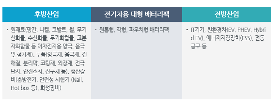

# 전기차용 대형 배터리팩 -  전후방 산업구조

전기차용 대형 배터리팩의 산업생태계에서 후방 산업은 이차전지 소재, 전극단자, 외장재를 생산하는 산업으로 구성되며, 전방 산업은 IT기기, 친환경차, 에너지저장장치산업, 전동공구 산업으로 구성되어 있습니다.

자세히 보게 되면 후방산업은 원재료(망간, 니켈, 코발트, 철, 무기산화물, 수산화물, 무기화합물, 고분자화합물 등 이차전지용 양극, 음극 및 첨가제), 부품(양극재, 음극재, 전해질, 분리막, 코팅재, 외장재, 전극단자, 안전소자, 전구체 등), 생산장비(충방전기, 안전성 시험기 (Nail, Hot box 등), 화성장비)를 생산하며
전방산업은 IT기기, 친환경차(EV, PHEV, Hybrid EV), 에너지저장장치(ESS), 전동공구 등으로 이루어져 있습니다.

## 참고문서
- KISTI 유망아이템 지식 베이스: [http://boss.kisti.re.kr/boss/item/item_print.jsp?unit_cd=PI000007](http://boss.kisti.re.kr/boss/item/item_print.jsp?unit_cd=PI000007)
