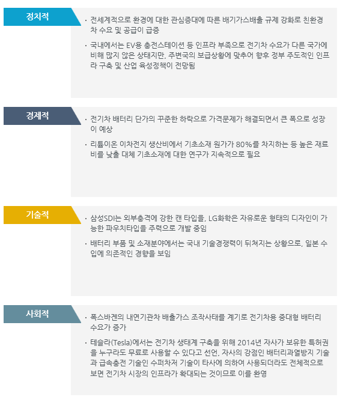

# 전기차용 대형 배터리팩 시장의 PEST는?

정치적 관점에서는 전세계적으로 환경에 대한 관심증대에 따른 배기가스배출 규제 강화로 친환경차 수요 및 공급이 급증하였고  
국내에서는 EV용 충전스테이션 등 인프라 부족으로 전기차 수요가 다른 국가에 비해 많지 않은 상태지만, 주변국의 보급상황에 맞추어 향후 정부 주도적인 인프라 구축 및 산업 육성정책이 전망됩니다. 

경제적 관점에서는 전기차 배터리 단가의 꾸준한 하락으로 가격문제가 해결되면서 큰 폭으로 성장이 예상됩니다.  
리튬이온 이차전지 생산비에서 기초소재 원가가 80%를 차지하는 등 높은 재료비를 낮출 대체 기초소재에 대한 연구가 지속적으로 필요합니다. 

기술적 관점에서는 삼성SDI는 외부충격에 강한 캔 타입을, LG화학은 자유로운 형태의 디자인이 가능한 파우치타입을 주력으로 개발 중입니다. 
배터리 부품 및 소재분야에서는 국내 기술경쟁력이 뒤쳐지는 상황으로, 일본 수입에 의존적인 경향을 보입니다. 

사회적 관점에서는 폭스바겐의 내연기관차 배출가스 조작사태를 계기로 전기차용 중대형 배터리 수요가 증가하였습니다. 
테슬라(Tesla)에서는 전기차 생태계 구축을 위해 2014년 자사가 보유한 특허권을 누구라도 무료로 사용할 수 있다고 선언, 자사의 강점인 배터리과열방지 기술과 급속충전 기술인 수퍼차저 기술이 타사에 의하여 사용되더라도 전체적으로 보면 전기차 시장의 인프라가 확대되는 것이므로 이를 환영합니다. 

 
성장요인으로는 전세계적으로 배기가스배출 규제 강화로 친환경차 수요 및 공급이 급증하여 일부 기업들의 배터리과열방지 및 급속충전 기술 관련 오픈소스가 되는 것입니다. 
저해요인으로는 국내 EV용 충전스테이션 등 인프라 부족으로 전기차 수요가 다른 국가에 비해 많지 않은 상태며 기초소재 원가가 80%를 차지하는 등 높은 재료비를 낮출 대체 기초소재에 대한 연구가 지속적으로 필요하다는 것입니다.  
배터리 부품 및 소재분야에서는 국내 기술경쟁력이 뒤쳐지는 상황입니다.   

## 참고문서
- KISTI 유망아이템 지식 베이스: http://boss.kisti.re.kr/boss/item/item_print.jsp?unit_cd=PI000007

