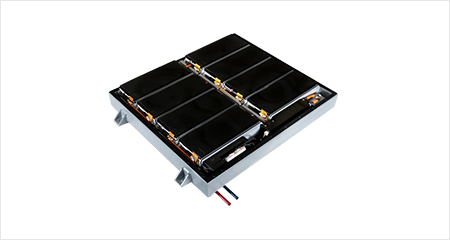

# 전기차용 대형 배터리팩 - 개념

전기차용 대형 배터리팩이란 화석연료와 엔진을 사용하지 않고, 전력으로 모터를 구동하는 전기차에서 사용되는 전기에너지 저장 장치를 말합니다. 전기차용 대형 배터리팩은 수송기기 외 ESS, 로봇, 수중장비 배터리 등에 활용이 가능합니다.

전체 시장의 70% 이상을 차지하는 소형인 IT용 배터리 성장세는 둔화되고 있는 반면, 전기차와 에너지저장장치(ESS) 등에 사용되는 중대형 배터리의 시장규모는 빠르게 커지고 있는 가운데, 전기차와 에너지저장장치(ESS)에 쓰이는 대용량 배터리는 조만간 2차전지 시장의 중심축이 될 전망입니다.
중대형 배터리의 또 다른 성장 축은 에너지저장장치(ESS)용 배터리로, ESS는 풍력이나 태양광 등 신재생에너지를 안정적으로 공급하는데 필수적인 장비입니다. ESS는 배터리와 전력변환장치(PCS), 이를 시스템화하는 설비(컨테이너 등)로 나눌 수 있고, 이 가운데 핵심은 전력을 저장했다 필요할 때 꺼내 쓸 수 있도록 역할을 하는 배터리라는 것입니다.

## 참고문서
- KISTI 유망아이템 지식 베이스: [http://boss.kisti.re.kr/boss/item/item_print.jsp?unit_cd=PI000007](http://boss.kisti.re.kr/boss/item/item_print.jsp?unit_cd=PI000007)
