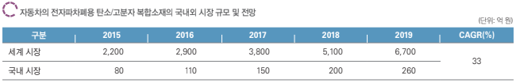

# 전자파차폐용 탄소복합소재 국내 시장의 시장 크기는?

삼성증권(국내 시장)에 따르면, 차량의 전장부품 시장은 2015년 국내 800억 원 시장 규모에서 연평균 33%씩 성장하여 2019년 국내 2,600억 원대의 시장이 형성될 것으로 전망됩니다. 
또한, 전문가 의견에 따르면 전자파 차폐용 탄소 복합소재는 전체 차량용 전장부품 시장 중 약 10% 내외를 점유할 것으로 예상됩니다.

## 참고문서
- 29-2015-자동차 전자파차폐용 탄소복합소재.pdf