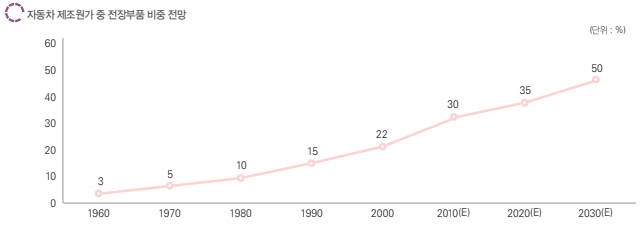
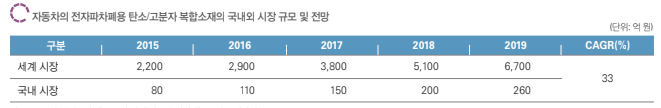

# 전자파차폐용 탄소복합소재 - 성장률

자동차산업의 전장화에 따라 전장부품이 제조원가에서 차지하는 비중이 점차 확대되고 있습니다. 2012년 Strategy Analytics 보고서에 따르면, 전장부품의 원가비중이 1990년대 15%에서 2000년 22%로 높아졌으며, 2010년 30%까지 높아졌고, 2020년에는 전장부품의 원가비중이 50%를 넘을 것으로 전망하고 있습니다.
특히, 차세대 동력원으로 부상하고 있는 전기자동차는 전기전자부품이 원가에서 차지하는 비중이 70%에 달할 것으로 예상되고 있습니다.

삼성증권(국내 시장), J. D. Power, Strategy Analytics(해외 시장, 2012.09)에 따르면, 차량의 전장부품 시장은 2015년 국내 800억 원, 세계 2조 2,000억 원 시장 규모에서 연평균 33%씩 성장하여 2019년 국내 2,600억 원, 해외 6조 7,000억 원대의 시장이 형성될 것으로 전망됩니다. 또한, 전문가 의견에 따르면 전자파 차폐용 탄소 복합소재는 전체 차량용 전장부품 시장 중 약 10% 내외를 점유할 것으로 예상되므로 이에 근거하여 자동차의 전자파 차폐용 탄소 복합소재의 국내외 시장 규모를 추정하면 아래 표와 같습니다.

## 참고문서
- BOSS Report: 29-2015-자동차 전자파차폐용 탄소복합소재.pdf
