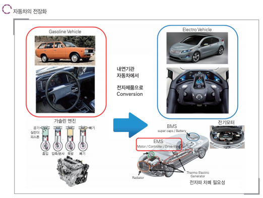
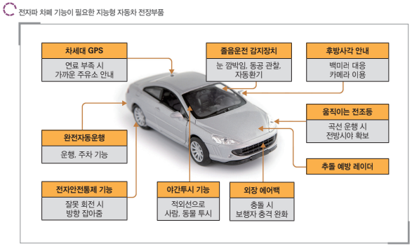

# 전자파차폐용 탄소복합소재 - 개념

편의성, 고급화 추구, 하이브리드 자동차 개발로 인하여 자동차에 고성능 전장부품을 다량 도입되면서 자동차가 점차 전자장치화 되어가는 추세입니다.
그러나 차량의 편의 증대를 위하여 도입한 각종 전자제어부품 및 장치로 인해 유해 전자파가 다량 방출되고, 불필요한 전자파 방사로 차량의 오작동 및 급발진 등의 안전사고 발생이 심각한 사회문제로 대두되고 있습니다. 따라서 차량 내부 전장부품에서 발생하는 전자파의 차폐 필요성이 점차 증대되고 있는 상황입니다.

유해 전자파 차폐를 위하여 차량 경량화용 고분자 복합소재에 탄소, 금속, 세라믹 등의 새로운 소재를 첨가하여 전자파 차폐라는 새로운 기능성을 갖는 복합소재들이 개발되고 있으며 이를 전자차폐용 탄소복합소재라 합니다.

## 참고문서
- BOSS Report: 29-2015-자동차 전자파차폐용 탄소복합소재.pdf
