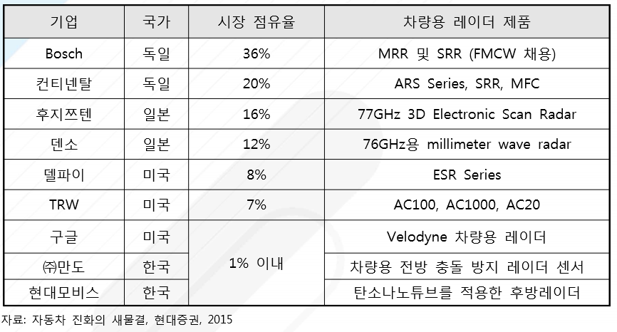

# 차량용 레이더 시장의 국내 주요 업체는?
 자율주행차량과 관련한 레이더 기술과 관련해서 국내 기업들의 기술은 매우 낮은 편입니다. 
 겨우 만도 만이 2016년에 독자적으로 제품을 만들어 냈으며 다른 기업들은 이 분야에서 거의 대부분 제품을 수 입하는 단계에 머물고 있습니다.  
 만도는 자동차 부품을 전문적으로 생산하는 업체로 국내 최초로 차량용 전방 충돌 방지 레이더 센서를 독자 개발하였습니다. 
 지난 2008년부터 개발을 시작해 6년여 의 연구를 통해서 적응형 순항 제어(SCC: Smart Cruise Control) 시스템에 장착될 예정입니다. 
 또한 북미 NCAP의 사용 권고 사항인 자동 제어장치(AEB) 기능이 포함된 저가형 충돌 방지 레이더 센서를 2018 년까지 개발할 계획을 세우고 있는데 이 시스템을 통해서 전측방 및 후측방 물체 감지 가능한 전방위 충돌 방지용 보급형 초소형 레이더를 상용화할 수 있을 것으로 보고 있습니다. 
 만도는 2015년 총 매출 5 조 3천억 원을 달성했으며, 레이더를 상용화하여 2020년에는 매출액 8조 5천억 원을 목표로 하고 있습니다.
 현대 모비스 역시 77 GHz 영역대의 레이더에 집중하고 있고 최근에는 LG화학과 협력하여 탄소나 노튜브를 적용한 후방 레이더용 흡수장치를 개발하여 신차 모델에 적용하였습니다. 
  
## 참고문서 
- 3-2016-차량용레이더.pdf