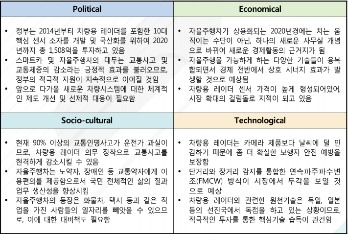

# 차량용 레이더 시장의 PEST분석하면?
Political(정치적)으로는 정부는 2014년부터 차량용 레이더를 포함한 10대 핵심 센서 소자를 개발 및 국산화를 위하여 2020 년까지 총 1,508억을 투자하고 있습니다. 
스마트카 및 자율주행차의 대두는 교통사고 및 교통체증의 감소라는 긍정적 효과를 불러오므로, 정부의 적극적 지원이 지속적으로 이어질 것입니다. 앞으로 다가올 새로운 차량시스템에 대한 체계적 인 제도 개선 및 선제적 대응이 필요합니다.
Economical(경제적)으로는 자율주행차가 상용화되는 2020년경에는 차는 움직이는 수단이 아닌, 하나의 새로운 사무실 개념으로 바뀌어 새로운 경제활동의 근거지가 됩니다.   자율주행을 가능하게 하는 다양한 기술들이 융복합되면서 경제 전반에서 상호 시너지 효과가 발생할 것으로 예상됩니다. 차량용 레이더 센서 가격이 높게 형성되어있어, 시장 확대의 걸림돌로 지적이 되고 있습니다.
Socio-cultural(사회적)으로는 현재 90% 이상의 교통인명사고가 운전가 과실이므로, 차량용 레이더 의무 장착으로 교통사고를 현격하게 감소시킬 수 있습니다. 
자율주행차는 노약자, 장애인 등 교통약자에게 이용편의를 제공함으로서 국민 전체적인 삶의 질과 업무 생산성을 향상시킵니다. 자율주행차의 등장은 화물차, 택시 등과 같은 직업을 가진 사람들의 일자리를 빼앗을 수 있으므로, 이에 대한 대비책도 필요합니다.
Technological(기술적)으로는 차량용 레이더는 카메라 제품보다 날씨에 덜 민감하기 때문에 좀 더 확실한 보행자 안전 예방을 보장합니다. 단거리와 장거리 감지를 통합한 연속파주파수변조(FMCW) 방식이 시장에서 두각을 보일 것으로 예상됩니다.
차량용 레이더와 관련한 원천기술은 독일, 일본 등의 선진국에서 독점을 하고 있는 상황이므로, 적극적인 투자를 통한 핵심기술 습득이 관건입니다.

 
## 참고문서 
- 3-2016-차량용레이더.pdf