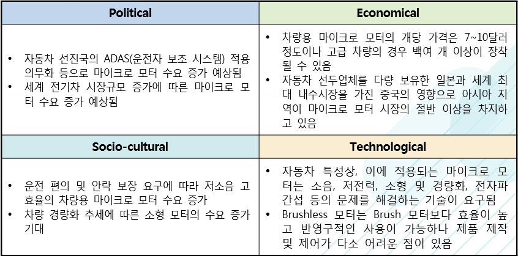

# 차랑용 마이크로 모터 시장의 PEST 분석을 하면?
Political(정치적)으로는 자동차 선진국의 ADAS(운전자 보조 시스템) 적용 의무화 등으로 마이크로 모터 수요 증가 예상됩니다. 세계 전기차 시장규모 증가에 따른 마이크로 모터 수요 증가 예상됩니다.
Economical(경제적)으로는 차량용 마이크로 모터의 개당 가격은 7~10달러 정도이나 고급 차량의 경우 백여 개 이상이 장착 될 수 있습니다. 자동차 선두업체를 다량 보유한 일본과 세계 최대 내수시장을 가진 중국의 영향으로 아시아 지역이 마이크로 모터 시장의 절반 이상을 차지고 있습니다. 
Socio-cultural(사회적)으로는 운전 편의 및 안락 보장 요구에 따라 저소음 고효율의 차량용 마이크로 모터 수요 증가합니다. 차량 경량화 추세에 따른 소형 모터의 수요 증가가 기대됩니다.
Technological(기술적)으로는 자동차 특성상, 이에 적용되는 마이크로 모터는 소음, 저전력, 소형 및 경량화, 전자파 간섭 등의 문제를 해결하는 기술이 요구됩니다. Brushless 모터는 Brush 모터보다 효율이 높고 반영구적인 사용이 가능하나 제품 제작 및 제어가 다소 어려운 점이 있습니다.

## 참고문서
- 7-2016-차량용마이크로모터.pdf