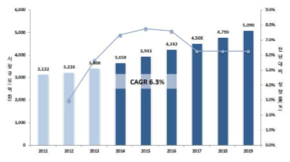

# 차량용 압력센서
국내 차량용 압력센서 시장은 2013년 3,408억 원에서 2019년 5,090억 
원까지 연평균 6.3%의 성장률을 보일 것으로 전망됩니다. 국내 차량용 압
력센서 시장은 수입산이 주도하고 있어 국산화율이 낮은 상황으로, 소
재기술에 대한 투자를 강화하고 대기업의 개발 참여를 유도하여 국내 
센서 시장 경쟁력을 확보해야 합니다.

## 참고문서
- 차량용 압력센서 기술 및 연구개발과 응용.pdf