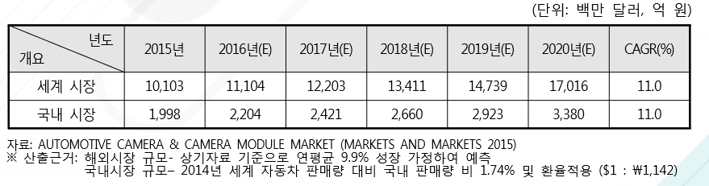

# 차량용 카메라의 국내시장의 크기는?
2014년 기준 국내 자동차 시장은 약 146만 대로 세계 자동차 시장 8,383만 대의 1.74%를 차지하고 있습니다. 이를 토대로 국내 자동차용 카메라 시장규모를 환산해 보았을 경우 2015년 1,998억 원 규모에 서 2020년에는 약 69% 성장한 3,380억 원의 시장규모를 가질 것으로 예상됩니다.
 

## 참고문서 
- 4-2016-운전자의 안전과 운행의 편리함을 보장해주는 자동차용 카메라.pdf