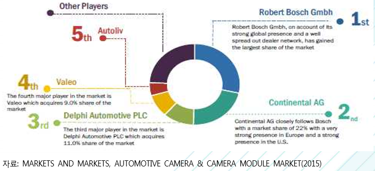

# 차량용 카메라의 시장점유율을 분석하면?
 2014년 기준 세계 차량용 카메라 및 카메라 모듈 시장은 Robert Bosch, Continental AG, Delphi Automotive, Valeo 및 Autoliv의 5개 기업이 시장을 선점하고 있으며, 각각 29%, 22%, 11%, 9%, 5% 의 시장점유율을 차지하고 있습니다.
 Robert Bosch는 세계 차량용 카메라 및 카메라 모듈 시장에서 기술 및 서비스 제공을 주도하고 있는 업체로써, 자동차 기술, 산업 기술, 소비재, 에너지 및 건설 기술 등 네 개의 사업부문 보유하고 있습니다. Bosch 그룹은 Robert Bosch를 비롯하여 전 세계 50여 개국에 360개 이상의 계열사 및 지사를 보 유하고 있는 상황입니다. Bosch는 Daimler와 공동으로 자동 주차 기술 개발 프로젝트를 진행 중이며 이 프로젝트에서 Bosch는 주차 공간 인식 센서 및 카메라와 통신 기술을 개발하고 있습니다.
 Delphi Automotive와 그 계열사들은 자동차용 카메라를 포함하는 자동차 부품을 제조하고 세계 자 동차 시장에 전기 및 전자부품, 파워트레인, 안전 및 열 기술 솔루션을 제공하고 있습니다. 사업부문은 크게 전기/전자 설계, 파워트레인 시스템, 전자제품 및 안전기술, 열 시스템 등 4가지로 분류되며, Volvo 와 파트너 쉽을 체결하여 Volvo의 XC90을 위한 가장 포괄적이고 기술적으로 정교한 표준 안전 패키지를 개발하고 있습니다. XC90은 Delphi의 Radar와 카메라 센서 통합 시스템(RACam)을 채택하고 있습니다. Continental AG는 독일의 자동차 회사이며 1871년에 고무 제조업체로 시작하여 현재 섀시 및 안전 기술, 파워트레인, 인테리어, 타이어, ContiTech, 기타 부문 등 총 6개의 사업부문을 보유하고 있으며, 영국 기반 회사인 ASL Lewes를 인수하여 이 기업의 360도 전 방향 탐지 기술에 대한 포트폴리오에 집중하고 카메라 분야에서 더 큰 경쟁력을 갖추고 있습니다.  
 Valeo는 다국적 자동차 공급업체로, 넓은 범위의 부품들을 자동차 제조업체 및 부품 시장에 제공하고 있으며, 자율 주행기술 및 이산화탄소(CO₂) 배출 감소 기술 등의 개발에도 참여하고 있습니다. 사업부 문은 운전보조 시스템, 파워트레인 시스템, 열 시스템, 가시성 시스템 등을 포함하며, 운전보조 시스템 은 주행보조, 내부 전 장품, 내부 제어 부품 등을 포함하고 있다.  Autoliv는 스톡홀름에 본사를 둔 스웨덴 기업으로, Autoliv가 제공하는 제품으로는 차량용 레이더, 야 간 주행보조, 카메라 기반 시각 시스템, 브레이크 제어 및 기타 능동 안전 시스템을 포함하고 있습니다.
 국내의 경우 자동차용 카메라 제조의 대표적인 업체로는 엠씨넥스, 세코닉스, LG 이노텍 등이 있습니다. 엠씨넥스는 휴대폰용 카메라 모듈과 자동차용 카메라 모듈을 생산하고 있으며 국내 자동차용 카메라 모듈 시장의 1위 사업자로 알려져 있습니다. 엠씨넥스는 주로 후방카메라와 탈선 경보 시스템 등의 센싱 카메라를 주력 제품으로 내세우고 있으며 자동차 카메라 모듈의 매출액은 2014년 704억 원, 2015년 901억 원을 기록하고, 2016년에는 1,171억 원을 달성 예정으로 지속적인 성장이 예상됩니다. 세코닉스는 국내 최대 모바일 카메라 렌즈 및 렌즈 모듈 회사로서 매출의 65%가 스마트폰에 사용되 는 카메라용 렌즈이며 자동차용 카메라 부품의 비중은 약 27%를 차지합니다. 주력 제품으로는 자동차 후방카메라 모듈로서 현대모비스에 납품 중이며 운전석에서 차량 밖 360도를 훤히 들여다볼 수 있는 AVM(Around View Monitoring) 시스템도 개발하여 현대모비스에 납품 중입니다. LG이노텍은 자동차용 카메라 모듈 및 무선 충전 솔루션, 차량용 무선통신장비, 모터·센서, 에너지관리 시스템 등 다양한 사업영역을 구축하고 있으며, 운전자 보조 시스템 용 무선 차량 통신, 스마트 카용 자동 위치 및 거리 측정기(Radar) 등 기존에 보유한 기술을 기반으로 복합 모듈에 관하여 제품 확대에 나설 계획입니다.
  

## 참고문서 
- 4-2016-운전자의 안전과 운행의 편리함을 보장해주는 자동차용 카메라.pdf