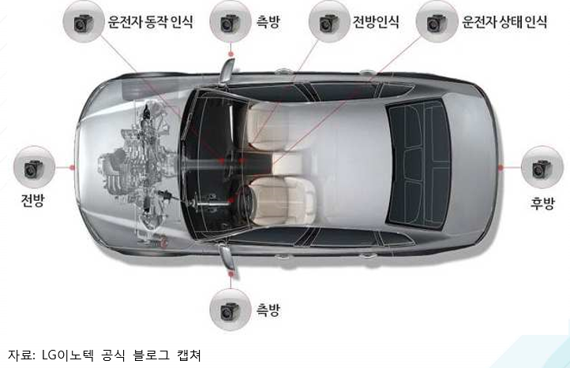

# 차량용 카메라란?
최근 자동차 산업분야에서는 무인자동차 관련 기술이 핵심 키워드로 떠오르고 있습니다. 무인자동차 시 스템을 구현하기 위해선 운전자 보조 시스템(ADAS: Advanced Driver Assistance Systems)을 차량 내· 외부에 적용해 차량 운행 시, 운전자의 편의 및 안전을 도모하고 충돌과 같은 돌발 상황에 대비하는 기술이 핵심입니다. 이를 해결하기 위해서는 차량의 내·외부환경을 인식하기 위한 기능이 필요하며, 자동 차용 카메라를 통하여 이러한 역할을 수행할 수 있습니다.    
자동차용 카메라는 시시각각 변화하는 운전 환경에 따라 적외선 카메라, 열화상 카메라, 디지털카메라 등이 상황에 맞는 기능을 발휘합니다. 적외선 카메라는 차량 내부에 설치되어 운전자 감시 시스템에 사용됩니다. 적외선 카메라를 운전자의 얼굴 방향에 위치시켜 주로 근거리 적외선 파장을 사용해 운전자의 얼굴 표정을 감시하고 운전자가 졸 음운전을 할 경우 경고 신호를 발생시킵니다. 열화상 카메라는 객체의 절대 온도에 기초하여 화상을 결정하는 기술로써, 물체에서 방출되는 열을 감 지하여 포착하는 기술이며 시야 확보가 어려운 야간에 물체를 감지할 수 있도록 합니다. 
디지털카메라는 캡처된 사진 이미지를 저장하는 디지털 포맷을 사용하며, 주로 CCD 카메라를 사용하 여 디지털카메라의 광센서를 통해 사물을 포착합니다. 디지털카메라는 많은 종류의 ADAS 시스템에 적용되고 있으며 차선 이탈 경고, 주차 보조, 도로 표지판 인식 등의 기술에 적용됩니다.
 

## 참고문서 
- 4-2016-운전자의 안전과 운행의 편리함을 보장해주는 자동차용 카메라.pdf